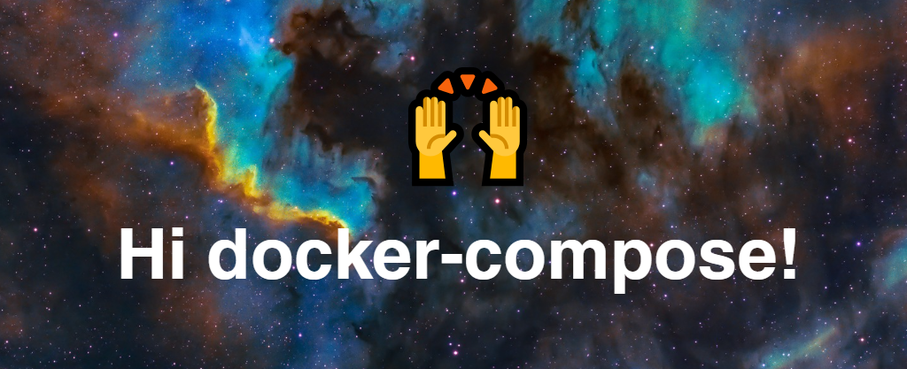

<kbd></kbd>
# 🪐 ESP – Repositorio Oficial de APIs Astronómicas 

Bienvenidos al repositorio  de la **Agencia Espacial Planetaria (ESP)👨‍🚀**.  

Este repositorio ha sido preparado por dos de nuestros mejores equipos de backend para que desarrolladores frontend puedan **empezar a trabajar inmediatamente**.

Las APIs incluidas son:

1. **Eventos Astronómicos** (Python + FastAPI)  
   - Listado de eventos próximos: eclipses, lluvias de meteoros, conjunciones, etc.  
2. **Frases Célebres de Astronomía** (PHP – vanilla)  
  - Listado de frases inspiradoras de Astronomía

---

## 🚀 Cómo empezar

**Paso 1: Clonar el repositorio**  

**Paso 2: Levantar los Contenedores**  

```bash
docker-compose up --build
```

¡Listo! Ya puedes consumir nuestras APIS en:
 - http://localhost:8086/events
- http://localhost:8087/quotes

> ¡A volaaaaaaaaar!

🚀🚀🚀🚀🚀🚀🚀🚀🚀🚀🚀🚀🚀🚀🚀🚀🚀🚀🚀🚀🚀🚀
